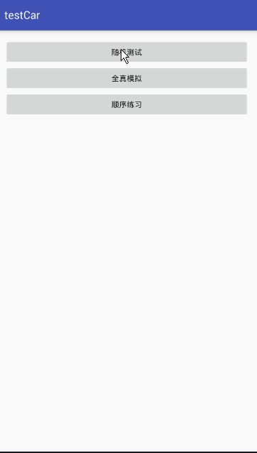

# CarExam
驾考c1,c2,a1,a2,b1,b2等考试考题框架

###该数据模拟的是阿凡达驾考数据,数据接口申请链接[啦啦啦](http://avatardata.cn/Docs/Api/1ccd64af-d0d9-4ddd-8bac-660344cf2f21)

该项目实现了单选和复选的题目，并且对model数据进行了合理的规划，解决了数据错乱的等问题。

Exam文件夹是我的初始版本，可以忽略，testCar文件夹是在Exam的基础上将他封装成库文件，进行使用，特别的方便实用，数据库文件放在了asset文件夹里面了，这个数据源是我通过php将阿凡达的全部数据解析到sqlit数据库，然后倒入到android里面的，里面有些判断题的答案为空，是因为阿凡达的数据源有点问题，还需要手动去更改。

##效果图

